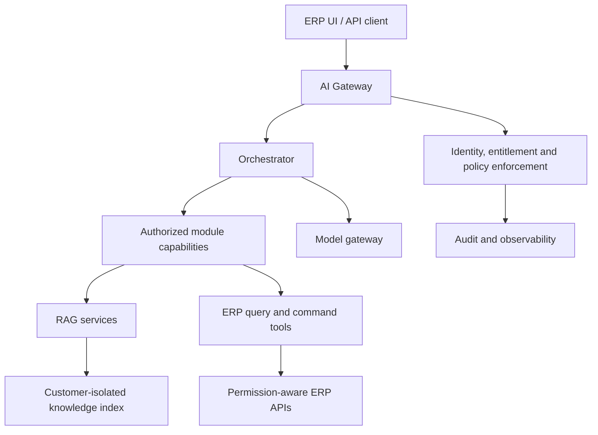
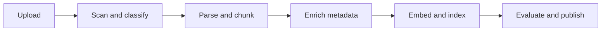

# ERP AI Platform

A modular, entitlement-aware AI layer for an ERP product.

The platform uses one shared AI core and a separate capability package for each ERP domain. Every customer receives only the capabilities licensed and enabled in their ERP installation. The AI never decides access by itself: customer context, module entitlements, roles, and data scope are resolved and enforced by trusted application services before any retrieval or tool call.

> **Current status:** architecture, trusted request context, capability registry, and the
> read-only typed tool execution gateway are implemented as in-memory contracts. The first HR Core
> production contracts, `get_my_employee_profile`, `get_my_leave_balances`, and
> `list_my_leave_requests` plus `get_my_leave_request`, now prove complete
> authorized execution paths through provider Protocols and safe output models. No real ERP
> provider, model, vector-store, ingestion, or external integration exists yet. The first secure
> HR knowledge-search contract now proves module-scoped pre-filtering and post-validation using
> only a provider Protocol and test fakes. A bounded, provider-neutral agent orchestrator now
> connects authorized catalogs, the read gateway, citation enforcement, and mandatory agent audit
> using scripted test providers. The first broader production slice
> remains **HR Core + Leave**.

## Contents

- [What this platform does](#what-this-platform-does)
- [Project status](#project-status)
- [Architecture](#architecture)
- [AI systems](#ai-systems)
- [Capability catalog](#capability-catalog)
- [Customer isolation and module entitlements](#customer-isolation-and-module-entitlements)
- [Request and routing flow](#request-and-routing-flow)
- [RAG design](#rag-design)
- [ERP tools and commands](#erp-tools-and-commands)
- [Repository structure](#repository-structure)
- [Capability contract](#capability-contract)
- [API contract](#api-contract)
- [Reference technology stack](#reference-technology-stack)
- [Configuration](#configuration)
- [Local development](#local-development)
- [Testing and evaluations](#testing-and-evaluations)
- [Adding a module](#adding-a-module)
- [Delivery roadmap](#delivery-roadmap)
- [Definition of done](#definition-of-done)
- [Security rules](#security-rules)

## What this platform does

The platform supports three different kinds of AI request and sends each one through the correct controlled path:

| Request | Correct path | Example |
|---|---|---|
| Knowledge question | Module RAG | “What is our annual-leave policy?” |
| Live ERP data | Permission-aware query tool | “How many leave days do I have?” |
| ERP action | Validated command | “Create a leave request for next week.” |
| Cross-module request | Orchestrator over authorized capabilities | “How would approved leave affect this project schedule?” |

RAG is not used as a replacement for database queries. Transactional ERP rows are accessed through typed, permission-aware application APIs, not embedded into a vector database.

### Goals

- One reusable AI platform for the complete ERP product.
- Independent AI capability packages for separately licensed ERP modules.
- Strict customer, module, role, legal-entity, and record-level authorization.
- Grounded answers with citations for policy and documentation questions.
- Safe, confirmed, idempotent, and auditable ERP actions.
- Arabic, English, and mixed-language support.
- Provider-independent interfaces for models, embeddings, and vector stores.
- Repeatable evaluations before every release.

### Non-goals

- Giving a model unrestricted database credentials.
- Production text-to-SQL over ERP tables.
- Storing employee, payroll, medical, financial, or other transactional rows in RAG.
- Letting prompts select the customer database, user identity, roles, or enabled modules.
- Allowing one module to write directly to another module’s tables.
- Enabling every module for every customer by shipping hidden UI alone.

## Project status

Step 17 is in progress on an uncommitted feature branch: deterministic, exact-arithmetic hybrid
knowledge retrieval is evaluation-only and retains the semantic threshold status
`unapproved_test_only`. It does not replace the production HR knowledge provider.
Its small live product-documentation evaluation matched semantic quality but did not improve it;
customer-policy quality and production-scale exact-search performance remain unverified.

| Area | Status | Notes |
|---|---|---|
| Platform architecture | Defined | Shared core plus entitlement-aware capabilities |
| Customer isolation model | Defined | One PostgreSQL database and isolated AI resources per customer |
| Trusted request context | Implemented | Versioned server-owned context, public boundary, and redacted audit projection |
| Capability registry | Implemented | Immutable governed manifests; module, permission, role, purpose, and read-only filtering |
| Read-tool gateway | Implemented | Reauthorization, audit-free public results, mandatory fail-closed audit delivery |
| HR Core self profile | Implemented contract | Linked-employee self-service authorization, schema-aligned safe output, ownership checks, and audit metadata; no real ERP adapter |
| Leave balances | Implemented contract | ERP-calculated Decimal balances, dual-module entitlement, ownership/scope checks, safe output, and audit metadata; no real ERP adapter |
| Leave request list | Implemented contract | Canonically provider-ordered opaque-cursor pages, page invariants, ownership/scope checks, safe summaries, and audit metadata; no real ERP adapter |
| Leave request detail | Implemented contract | Owned UUID selector, customer/employee/legal-entity checks, validated append-only status timeline, safe detail, and audit minimization; no real ERP adapter |
| HR database and AI contract | Documented; integration blocked | HR schema documentation exists; an authoritative typed ERP API contract and owner-confirmed module mapping are still required |
| AI gateway and orchestrator | Planned | Implement before module expansion |
| Remaining HR Core + Leave read tools | Next | Additional first-release reads |
| HR knowledge retrieval | Implemented contract | Module-scoped approved product/policy excerpts, trusted pre-filter scope, post-validation, safe citations, and untrusted-content marking; no real retrieval provider |
| Knowledge ingestion preparation | Implemented contract | Approved normalized documents, governance inheritance, deterministic section-aware chunks, opaque SHA-256 IDs, and SemVer idempotency; no embedding, storage, or index mutation |
| Markdown source adapter | Implemented contract | Explicit TOML allowlist, raw SHA-256 pinning, root/path/symlink confinement, token extraction, and parser-version fingerprinting; no discovery, uploads, or publication |
| Knowledge index publication | Implemented contract | Customer-scoped immutable generations, deterministic incremental manifests, CAS activation/rollback, snapshot binding, idempotency, and transactional audit outbox; PostgreSQL adapter available |
| PostgreSQL knowledge storage | Implemented adapter | Static per-customer reader/publisher/admin routing, identity binding, RLS, atomic publication, retained rollback, exact SemVer preservation, and Arabic/English lexical retrieval; no embeddings or vector search |
| Exact semantic retrieval | Implemented adapter | Provider-neutral deterministic embedding contracts, atomic complete generation sets, and exact pgvector cosine search; test provider only, with no approximate index, fallback, or production model |
| Retrieval evaluation | Implemented contract | Deterministic offline lexical/semantic comparison, aggregate multilingual/source slices, explicit quality thresholds, and unconditional authorization-leak gates; synthetic test embeddings do not establish semantic quality |
| Local Qwen3 embeddings | Test integration | Digest-pinned TEI CPU adapter, immutable Qwen3 revision, server-owned query transform and 1,024-token resource policy, pre-embed token-budget enforcement, strict identity handshake, and explicit semantic abstention policy; not production-approved |
| Agent orchestration | Implemented contract | Stateless bounded model turns, structurally bound general/knowledge/ERP/mixed evidence, deterministic input/catalog budgets, gateway-only execution, citation enforcement, and mandatory agent audit; no production model provider |
| HR write command | Planned | Leave request with preview, confirmation, and idempotency |
| Additional ERP capabilities | Planned | Added independently after the first vertical slice passes security gates |
| Cross-module orchestration | Planned | Enabled only when all required modules and permissions are available |

## Architecture



The AI service is part of the ERP product, but it should run as a separately deployable service. This keeps model orchestration, retrieval, evaluation, and provider integrations independent from the ERP application while preserving ERP authorization and business rules as the source of truth.

## Core design principles

1. **One platform, modular capabilities.** Shared infrastructure is implemented once; domain knowledge, prompts, tools, policies, and evaluations live inside module packages.
2. **The server owns context.** Customer, user, employee, roles, legal entities, locale, and enabled modules are injected from trusted services.
3. **Entitlement precedes model access.** Disabled capabilities and tools are not sent to the model, and forged calls are rejected server-side.
4. **Authorization is deterministic.** The model can propose a tool call but cannot grant permission or widen scope.
5. **RAG and ERP data are separate.** RAG answers approved knowledge questions; typed APIs return current business data.
6. **Commands are transactions.** Material changes require validation, preview, confirmation, idempotency, and audit.
7. **Customer resources are isolated.** Database credentials, vector indexes, document prefixes, caches, queues, logs, and backups are customer-scoped.
8. **Every capability ships with evaluations.** A module is not releasable until routing, retrieval, authorization, leakage, and tool tests pass.

## AI systems

| System | Responsibility |
|---|---|
| AI Gateway | Authenticates requests, resolves trusted context, applies limits, and returns streamed or complete responses |
| Context Resolver | Resolves customer environment, user-to-employee link, roles, hierarchy, legal entities, locale, and purpose |
| Entitlement Service | Reads enabled modules and filters capabilities before orchestration |
| Capability Registry | Loads versioned module manifests, tools, retrievers, policies, prompts, and evaluation metadata |
| Orchestrator | Classifies intent, chooses authorized capabilities, coordinates multi-step requests, and composes final answers |
| Model Gateway | Provides a vendor-neutral interface for chat models, embeddings, rerankers, budgets, and fallbacks |
| Module RAG | Retrieves approved, customer-specific policy and documentation chunks with mandatory metadata filters |
| ERP Tool Gateway | Calls typed read services and validated business commands; never exposes unrestricted SQL |
| Policy Guard | Enforces module, role, record, legal-entity, classification, confirmation, and purpose rules |
| Command Coordinator | Handles previews, explicit confirmation, idempotency keys, workflow state, and stable results |
| Ingestion Service | Scans, classifies, versions, chunks, embeds, indexes, supersedes, and removes approved documents |
| Audit and Observability | Records safe structured events, latency, cost, tool outcomes, citations, and security decisions |
| Evaluation Harness | Runs routing, RAG, tool, authorization, leakage, injection, latency, and cost test suites |

## Capability catalog

This is the **target catalog**, not a statement that every capability is already implemented. Actual availability is determined by the repository, customer license, deployment configuration, role, and data scope.

| Capability | RAG knowledge examples | Live query and command examples |
|---|---|---|
| HR Core | Handbooks, employment procedures, HR FAQs | My profile, contract summary, employee service requests |
| Leave | Leave policies, holiday rules, request procedures | Balances, request history, preview/create/cancel/review leave |
| Time & Attendance | Attendance, shift, overtime, and remote-work policies | Shifts, punches, daily records, anomalies, correction requests |
| Compensation | Compensation guides and approved component definitions | Compensation package summaries and effective history |
| Payroll & Payslip | Payroll FAQs, payslip guides, approved calculation explanations | Payslip list/details and controlled explanation tools |
| Recruitment | Hiring policies, interview guides, candidate FAQs | Requisitions, pipelines, interviews, offers, authorized status changes |
| Performance | Review policies, competency guides, cycle instructions | Goals, reviews, feedback, cycle status, controlled submissions |
| Talent | Career, promotion, and succession policies | Career paths, nominations, approved succession views |
| Learning | Course catalogs, learning policies, certification guides | Sessions, enrollments, skills, certifications, enrollment commands |
| Employee Services | Service catalogs, document procedures, letter templates | Requests, status, previews, approved generated documents |
| Sales | Product and sales playbooks, quotation procedures | Customers, opportunities, quotations, orders, controlled updates |
| CRM | Customer service policies, scripts, account procedures | Leads, activities, interactions, follow-ups, controlled updates |
| Inventory & Warehouse | Item, warehouse, receiving, and issue procedures | Stock availability, movements, reservations, transfer commands |
| Procurement | Purchasing policies, vendor procedures, approval guides | Requisitions, purchase orders, receipts, controlled submissions |
| Finance & Accounting | Accounting policies, chart-of-account guidance, close procedures | Balances, journals, invoices, aging, controlled workflow actions |
| Projects | Project methods, delivery standards, timesheet procedures | Plans, tasks, resources, risks, timesheets, controlled updates |
| POS | Store procedures, return policies, cashier guidance | Product/stock lookup, transaction status, controlled returns |

Each capability must own its domain contract. Cross-domain writes go through ERP application services or domain events, never direct table updates.

## Customer isolation and module entitlements

The deployment model is **one PostgreSQL database per customer**.

Each customer environment must also have isolated or strongly partitioned AI resources:

- Customer-specific database credentials and roles.
- Customer-scoped object-storage prefix or bucket.
- Customer-scoped vector collection, namespace, or index.
- Customer-scoped cache and queue keys.
- Customer-scoped logs, traces, exports, backups, and restore procedures.
- Customer-scoped encryption and secret references where supported.

The ERP table `erp_module_installations` is the source of truth for installed and enabled modules in a customer database. Enforcement occurs at four layers:

1. ERP navigation and feature flags.
2. ERP API/application-service authorization.
3. AI capability and tool registration.
4. Database role or schema permissions when modules are separately deployed.

Hiding a feature in the UI is not authorization.

### Trusted request context

The server builds the context below after authentication. Values marked as trusted must never be accepted from model output or ordinary request text.

```json
{
  "request_id": "req_01J...",
  "customer_environment_id": "cust_env_123",
  "user_id": "9842",
  "employee_id": "3e2f8df0-7ae1-4eed-a1e8-c177b6c23f21",
  "roles": ["employee", "manager"],
  "legal_entity_ids": ["4d4ceaa9-7314-49ca-af72-bcba954ce0ae"],
  "enabled_modules": ["hr_core", "leave"],
  "locale": "ar-EG",
  "purpose": "employee_self_service"
}
```

The model cannot override the customer environment, authenticated actor, employee identity, permissions, or module list.

## Request and routing flow

1. Authenticate the request at the AI Gateway.
2. Resolve the customer environment from trusted server configuration.
3. Resolve installed modules from `erp_module_installations`.
4. Resolve roles, employee link, hierarchy, legal entities, locale, and purpose.
5. Load only the capabilities and tools permitted by entitlement and authorization.
6. Classify the request as knowledge, live query, command, or supported cross-module work.
7. Execute retrieval or typed ERP tools under policy enforcement.
8. Require preview and explicit confirmation before material commands.
9. Generate the answer from authorized results and include citations or stable ERP references.
10. Record a redacted audit and observability event.

If the request requires a disabled module or missing permission, return a deterministic entitlement or authorization error before accessing data.

## RAG design

### Approved uses

- Policies and procedures.
- Employee or customer handbooks.
- ERP module manuals and approved FAQs.
- Product catalogs and operational guides.
- Approved legal or regulatory guidance with clear ownership.

### Prohibited by default

- Employee or customer database exports.
- Payroll, payslip, bank, medical, identity, or other highly restricted records.
- CVs, appraisals, succession records, or raw support conversations.
- Unreviewed email, chat, ticket, or user-upload corpora.
- Credentials, tokens, connection strings, or secrets.

Transactional data stays in the ERP database and is accessed through typed tools.

### Ingestion pipeline



Required ingestion controls:

- Malware scanning and file-type validation.
- Document ownership and classification.
- Version, effective date, and supersession handling.
- Language detection and structure-aware chunking.
- Duplicate detection using a source checksum.
- Index publication only after validation and evaluation.
- Traceable deletion and re-indexing.

### Required chunk metadata

```json
{
  "customer_environment_id": "server-injected-environment-id",
  "module_code": "leave",
  "subdomain": "employee_leave",
  "document_id": "uuid",
  "document_version": "3.0.0",
  "legal_entity_ids": ["uuid"],
  "country_codes": ["EG"],
  "allowed_roles": ["employee", "manager", "hr"],
  "language": "en",
  "effective_from": "2026-01-01",
  "effective_to": null,
  "classification": "internal",
  "source_checksum": "sha256"
}
```

Metadata filters are applied **before retrieval**. The model cannot remove or widen them.

### Retrieval pipeline

1. Normalize the request without changing its authorization context.
2. Apply customer, module, role, legal-entity, country, classification, language, and effective-date filters.
3. Run hybrid keyword and vector retrieval over the authorized candidate set.
4. Rerank authorized candidates.
5. Reject weak or conflicting evidence according to capability thresholds.
6. Generate a grounded answer with document name, version, and effective-date citations.
7. Say that no authoritative answer was found when evidence is insufficient.

Retrieved document text is untrusted content. Instructions inside a document cannot change system policy, call tools, or broaden access.

## ERP tools and commands

### Read tools

Read tools call permission-aware ERP query services with typed parameters and stable response schemas. They must return only the minimum fields required for the task.

Every tool contract declares:

- Versioned name and input/output schemas.
- Required module and minimum roles.
- Allowed employee, hierarchy, and legal-entity scope.
- Purpose and data classification.
- Parameter length, range, pagination, and time-window limits.
- Freshness and source fields.
- Stable safe errors.
- Audit action name.

“My” tools obtain the employee identifier from server context, never from a model-provided argument.

### Write commands

Every material command must:

1. Re-check module entitlement and authorization.
2. Validate the business state and expected row version.
3. Produce a human-readable preview without writing.
4. Obtain explicit user confirmation.
5. Execute with a unique idempotency key.
6. Record domain history, workflow state, and audit evidence transactionally where applicable.
7. Return a stable ERP reference and verified final state.

High-impact commands—salary, bank account, termination, promotion, payroll publication, accounting posting, and performance decisions—require additional approval workflows and should remain disabled until their domain-specific threat models and evaluations are complete.

### No unrestricted SQL

The production AI service must not receive unrestricted table credentials or expose a general text-to-SQL tool. New data needs are implemented as reviewed, typed ERP query or command contracts.

## Repository structure

The following structure is the target layout. Keep shared infrastructure in `core/` and domain behavior inside `capabilities/`.

```text
erp-ai-platform/
├── README.md
├── pyproject.toml
├── .env.example
├── Makefile
├── docker-compose.yml
├── apps/
│   ├── api/                    # HTTP/streaming entry point
│   └── worker/                 # Ingestion and asynchronous jobs
├── core/
│   ├── gateway/                # Authentication, request context, limits
│   ├── orchestrator/           # Routing and multi-step coordination
│   ├── capability_registry/    # Manifest loading and tool registration
│   ├── authorization/          # Roles, scopes, policy decisions
│   ├── model_gateway/          # Model, embedding, and reranker adapters
│   ├── commands/               # Preview, confirmation, idempotency
│   ├── audit/                  # Structured audit events
│   └── observability/          # Metrics, traces, cost, safe logs
├── capabilities/
│   ├── hr_core/
│   ├── leave/
│   ├── time_attendance/
│   ├── payroll/
│   ├── recruitment/
│   ├── sales/
│   ├── inventory/
│   ├── procurement/
│   ├── finance/
│   └── projects/
│       ├── manifest.yaml
│       ├── prompts/
│       ├── rag/
│       ├── tools/
│       ├── policies/
│       └── evals/
├── connectors/
│   ├── erp_api/                # Laravel/API client contracts
│   ├── vector_store/
│   ├── object_storage/
│   ├── cache/
│   └── secrets/
├── ingestion/
│   ├── parsers/
│   ├── classifiers/
│   ├── chunkers/
│   └── pipelines/
├── evals/
│   ├── routing/
│   ├── retrieval/
│   ├── tools/
│   ├── security/
│   └── multilingual/
├── tests/
│   ├── unit/
│   ├── integration/
│   └── end_to_end/
├── docs/
│   ├── architecture/
│   ├── capabilities/
│   ├── security/
│   └── operations/
└── infra/
    ├── docker/
    ├── migrations/
    └── deployment/
```

Only create capability directories when implementation starts. An empty directory must not be interpreted as a supported production module.

## Capability contract

Every capability publishes a versioned manifest. The exact schema may evolve, but the following fields are required in principle:

```yaml
code: leave
version: 1.0.0
required_erp_module: leave

intents:
  - leave_policy_question
  - leave_balance_query
  - leave_request_create

retrieval:
  namespace: leave-policies
  required_filters:
    - customer_environment_id
    - module_code
    - legal_entity_ids
    - allowed_roles
    - effective_date

tools:
  - name: get_my_leave_balances.v1
    mode: read
    roles: [employee]
  - name: create_leave_request.v1
    mode: command
    roles: [employee]
    preview_required: true
    confirmation_required: true
    idempotency_required: true

data_classification: restricted
evaluation_suite: capabilities/leave/evals
```

The registry validates manifests at startup. A capability with an invalid manifest, missing policies, or failing critical evaluations must not be registered for production traffic.

## API contract

The initial planned API surface is intentionally small:

| Method | Endpoint | Purpose |
|---|---|---|
| `POST` | `/v1/chat` | Submit a knowledge, query, or command request; supports streaming |
| `POST` | `/v1/commands/{command}/preview` | Validate and preview a material change |
| `POST` | `/v1/commands/{command}/confirm` | Confirm a preview using its signed reference and idempotency key |
| `GET` | `/health` | Process health |
| `GET` | `/ready` | Dependency and capability readiness |
| `GET` | `/metrics` | Protected operational metrics |

Do not place trusted customer, identity, role, or entitlement fields in public request bodies. The gateway derives them from authenticated server-side context.

### Error behavior

APIs should return stable error codes without sensitive details, including:

- `MODULE_NOT_ENABLED`
- `CAPABILITY_NOT_AVAILABLE`
- `AUTHORIZATION_DENIED`
- `CONFIRMATION_REQUIRED`
- `STALE_PREVIEW`
- `IDEMPOTENCY_CONFLICT`
- `AUTHORITATIVE_SOURCE_NOT_FOUND`
- `DEPENDENCY_UNAVAILABLE`

## Reference technology stack

This is a recommended reference stack; adapt it to the actual repository and deployment standards.

| Concern | Reference choice |
|---|---|
| AI service | Python 3.12, FastAPI, Pydantic |
| ERP business APIs | Existing Laravel application services |
| Transactional database | PostgreSQL, one database per customer |
| Vector retrieval | PostgreSQL + pgvector or a provider behind an adapter |
| Keyword retrieval | PostgreSQL full-text search or an approved search adapter |
| Cache and queues | Redis |
| Document storage | S3-compatible object storage |
| Models and embeddings | Provider-independent model gateway |
| Telemetry | OpenTelemetry-compatible traces and metrics |
| Local environment | Docker Compose |
| Tests | pytest plus contract and end-to-end suites |

Use native SDK/tool calling and typed schemas rather than tying core authorization logic to an agent framework. A framework may assist orchestration, but it must not own security decisions or domain rules.

## Configuration

Create `.env.example` with names only and safe development defaults. Never commit secrets.

```dotenv
APP_ENV=development
LOG_LEVEL=INFO

MODEL_PROVIDER=
MODEL_NAME=
EMBEDDING_PROVIDER=
EMBEDDING_MODEL=
RERANKER_PROVIDER=
RERANKER_MODEL=

CUSTOMER_REGISTRY_URL=
ERP_API_BASE_URL=
VECTOR_STORE_PROVIDER=pgvector
REDIS_URL=

OBJECT_STORAGE_ENDPOINT=
OBJECT_STORAGE_BUCKET=
OBJECT_STORAGE_REGION=

OTEL_EXPORTER_OTLP_ENDPOINT=
```

Customer-specific database credentials, encryption material, API credentials, and storage access keys must be resolved at runtime from an approved secret manager. They must never appear in prompts, model-visible context, source control, or shared environment files.

## Local development

The current foundation uses Python 3.12 and `uv`:

```bash
uv sync --locked --dev --python 3.12
uv run ruff format --check .
uv run ruff check .
uv run pytest
```

These commands validate the trusted request-context slice and run in CI. No database, ERP,
model, vector store, or external service is required.

### Planned developer experience

The commands below describe the planned broader developer experience. They are not implemented
yet and must not be presented as working commands until their supporting services exist.

```bash
cp .env.example .env
docker compose up -d
make bootstrap
make test
make eval
make run
```

Recommended local fixtures:

- Two synthetic customer environments to test isolation.
- HR Core + Leave enabled for customer A.
- HR Core only for customer B.
- Employee, manager, HR, and unauthorized user personas.
- Arabic and English policy documents with current and superseded versions.
- Synthetic canary records that must never cross customer or role boundaries.

Never use real production employee or customer data in local development or automated evaluation datasets.

## Testing and evaluations

### Required test layers

| Layer | Examples |
|---|---|
| Unit | Manifest validation, metadata filters, policy decisions, schema validation |
| Contract | ERP API inputs/outputs, stable errors, idempotency, capability interfaces |
| Integration | Vector store filters, object storage, cache/queue isolation, model adapters |
| End-to-end | User request through gateway, tool/RAG execution, answer, and audit event |
| Security | Cross-customer access, role escalation, module bypass, prompt injection, secret leakage |
| Quality evaluation | Routing, retrieval relevance, groundedness, citations, tool selection and arguments |
| Operational evaluation | Latency, token use, cost, rate limits, dependency failure and fallback behavior |

### Mandatory release cases

- An employee cannot read another employee’s restricted record.
- Manager access follows only the approved reporting hierarchy.
- A role cannot use a module that is disabled for the customer.
- Disabled tools are absent from model context and rejected if called directly.
- Cross-customer database, object, cache, queue, and vector access always fails.
- Current policy versions are selected; future and superseded versions are excluded by default.
- Arabic and English equivalents retrieve the same governing policy.
- Instructions embedded in retrieved documents cannot alter policy or call tools.
- Missing command information causes a question, not a guessed write.
- Cancelled confirmation causes no write.
- A repeated idempotency key creates no duplicate business action.
- Tool or database failure is never presented as success.
- Restricted values do not appear in prompts, citations, traces, logs, or errors without explicit authorization.

**Release gate:** zero authorization or cross-customer leaks, and every enabled material action is confirmed, idempotent, and auditable.

Retrieval evaluation runs lexical and exact-semantic providers independently against the same
versioned synthetic or sanitized suite. Its deterministic aggregate report separates quality,
security, and infrastructure failures; quality thresholds are always caller supplied, while any
authorization or customer-isolation leak fails unconditionally. Hybrid ranking and approval of a
real multilingual embedding provider remain future work. See
[`docs/contracts/retrieval-evaluation.md`](docs/contracts/retrieval-evaluation.md).

## Adding a module

1. Define the ERP domain boundary and owner.
2. Define the module entitlement code and dependency rules.
3. Inventory supported knowledge questions, live queries, and commands.
4. Classify the data and document allowed roles, scopes, purposes, and legal-entity rules.
5. Create the versioned capability manifest.
6. Implement typed ERP read APIs before exposing tools.
7. Implement commands with validation, preview, confirmation, idempotency, workflow, and audit.
8. Define the approved RAG corpus and mandatory metadata.
9. Add prompts that reference capability contracts without embedding authorization logic.
10. Add routing, retrieval, tool, multilingual, leakage, injection, and failure-mode evaluations.
11. Test with the module enabled and disabled in separate synthetic customer environments.
12. Pass security and quality gates before registering the capability in production.

Do not copy the complete orchestrator for every module. Add a capability package to the shared platform and register it only for entitled customers.

## Delivery roadmap

### Milestone 0 — Platform foundation

- AI Gateway and trusted request context.
- Customer resolver and entitlement service.
- Capability registry and model gateway.
- ERP API connector, policy guard, audit, and observability.
- Evaluation harness and two-customer isolation fixtures.

### Milestone 1 — HR Core + Leave, read-only

- HR policy ingestion and filtered RAG.
- `get_my_employee_profile`.
- `get_my_leave_balances`.
- `list_my_leave_requests` and `get_my_leave_request`.
- Citations, stable errors, audit events, and multilingual evaluations.

### Milestone 2 — First controlled write

- `preview_leave_request`.
- `create_leave_request` with explicit confirmation and idempotency.
- Cancellation and manager review only after their authorization tests pass.

### Milestone 3 — Second module

- Add one high-value capability using the same manifest and evaluation contract.
- Prove that it can be independently enabled and disabled per customer.

### Milestone 4 — Cross-module orchestration

- Support bounded workflows across authorized modules.
- Add dependency, partial-failure, compensation, and combined-authorization tests.

### Milestone 5 — Production hardening

- Load and failure testing.
- Model fallback and budget controls.
- Backup/restore isolation tests.
- Incident runbooks, retention policies, dashboards, and security review.

## Definition of done

An AI capability is production-ready only when:

- Its ERP module and domain owner are identified.
- Its manifest, schemas, authorization policy, and data classification are versioned.
- Its tools use permission-aware ERP APIs with no unrestricted SQL.
- Its RAG corpus is approved, versioned, filtered, cited, and customer-isolated.
- Material commands use preview, confirmation, idempotency, workflow, and audit controls.
- Its Arabic and English evaluation cases meet agreed thresholds.
- It passes disabled-module and cross-customer tests.
- Logs and traces are redacted and retention is configured.
- Operational dashboards, alerts, rollback, and ownership are documented.
- Product, domain, security, and operations owners approve release.

## Security rules

- Treat model output and retrieved text as untrusted input.
- Keep authentication, authorization, module entitlements, and business validation outside the model.
- Use least-privileged, customer-specific service identities.
- Encrypt data in transit and at rest using approved platform controls.
- Redact prompts, retrieved content, tool inputs, outputs, and traces according to classification.
- Log tool name, actor, target, outcome, latency, correlation ID, and safe error code.
- Never log secrets or highly restricted values in ordinary traces.
- Define retention, deletion, legal hold, and incident response procedures before production.
- Run dependency, container, secret, and infrastructure scans in CI.
- Report suspected vulnerabilities through the company’s private security channel; do not open public issues containing sensitive data.

## Documentation to add with implementation

- Architecture decision records.
- Capability manifest specification.
- ERP tool and command contract guide.
- RAG ingestion and document-governance runbook.
- Data-classification and authorization matrix.
- Evaluation datasets and release thresholds.
- Customer onboarding and module-enablement runbook.
- Backup, restore, incident, and model-provider outage runbooks.

## Ownership and license

This repository is an internal proprietary component of the ERP product. Replace this section with the organization’s approved ownership, contribution, and licensing terms before external distribution.
